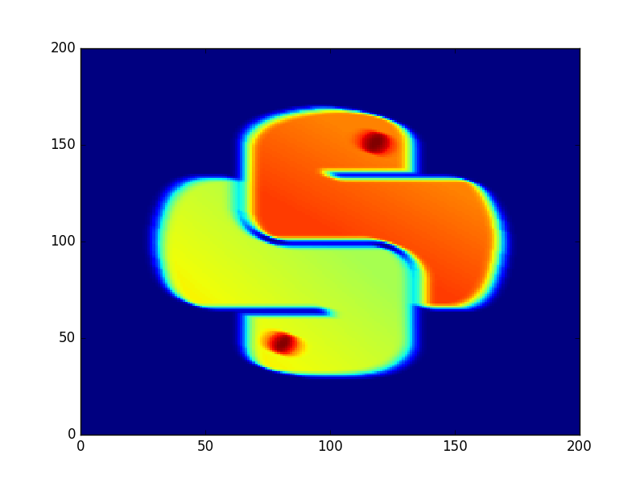
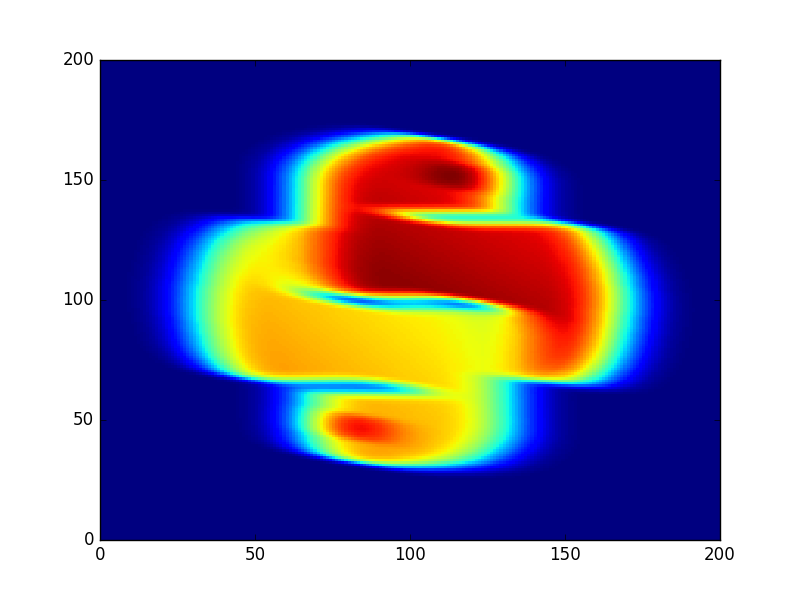
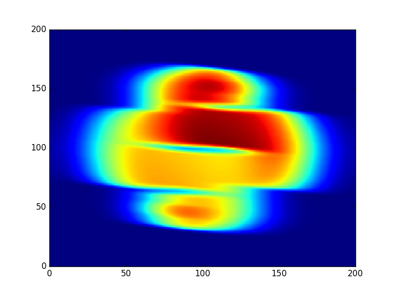
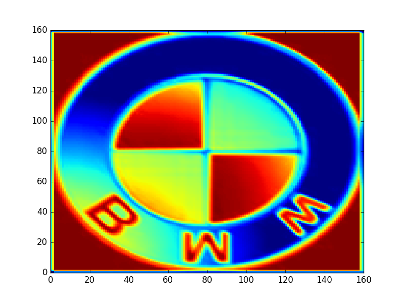
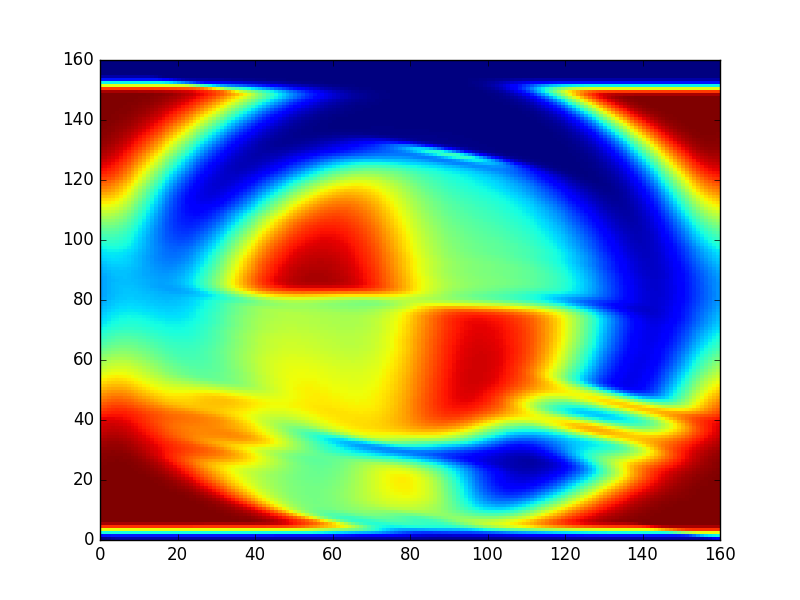
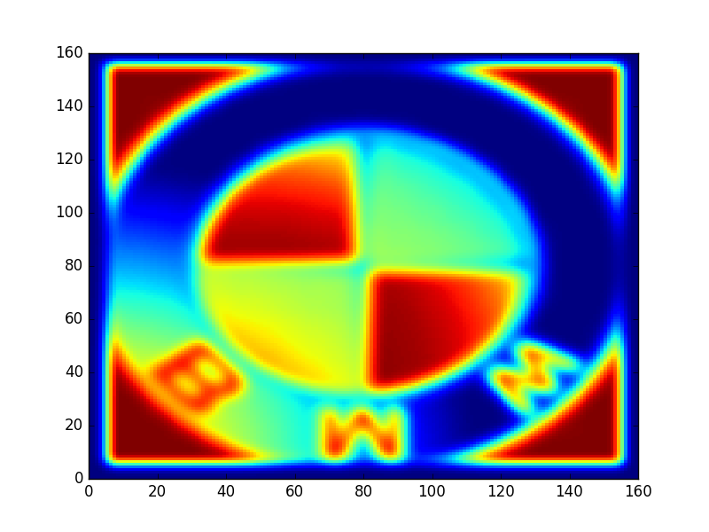

# Convolutions and Transposed Convolutions

Perform convolutions and transposed convolutions, saving the output along the way.  This will help develop a more intuitive understand of what's happening.

## Convolution Examples

As you perform more convolutions, the equivalent transposed convolution will result in an image of lower fidelity than the original image.  This is due to the [upsampling being performed](https://www.youtube.com/watch?v=ByjaPdWXKJ4&feature=youtu.be&t=20m20s).  This can be seen using the images in the [examples directory](./examples).  Consider the following examples of images and various numbers of convolutions followed by an equivalient number of transposed convolutions.

### Python logo


| Original image | 1 cycle | 3 cycles | 5 cycles |
|---|---|---|---|
|  |  |  |  |

It can be seen that with more convolutions, it is harder to recover the original image directly.

### BMW logo


| Original image | 1 cycle | 3 cycles | 5 cycles |
|---|---|---|---|
|  |  |  |  |

Once again, it is harder to recover the original image directly.

## Using the script

### CLI Inputs

| Args | Description | Default |
|------|-------------|---------|
| --image | The path to the image file | images/python.png |
| --num-convolutions | The number of convolutions (and transposed convolutions) to perform | 3 |

### Command

```sh
python convolutions.py --image <path to image> --num-convolutions <number of convolutions>
```

For example:

```sh
python convolutions.py --image images/python.png --num-convolutions 3
```
